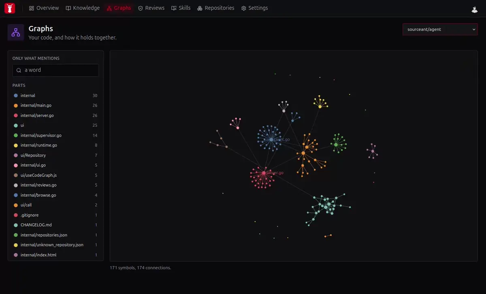

  <picture>
    <source media="(prefers-color-scheme: dark)" srcset="docs/assets/sourceant-lockup-colour-dark.svg">
    
  </picture>

<strong>Software intelligence for you and your coding agents.</strong>

AI is writing code faster than you and your team can understand it. SourceAnt helps you stay ahead. It shows you what is being built, checks changes against your decisions and requirements, and keeps your system architecture visible as the code moves.

You can let agents move quickly without giving up control of where your software is going.

**[Run it](#run-it-locally)** on your computer now. No account required.

  

## Use cases

Out of the box, on your own machine:

- **Code graph.** Every repository you add, parsed into files, symbols and the relationships between them.
- **Local code review.** Read a checkout before anybody else sees it, through the same reviewer a pull request goes through.
- **Review on pull requests.** The same reviewer on the forge, commenting where the line is.
- **Knowledge and requirements.** What you decided and what the software must do, kept between sessions and linked to the code that carries it.
- **Skills over MCP.** SourceAnt discovers the skills you already have and serves them back to your coding tools.
- **One place for every index.** All your repositories in a single local store, each under its own scope, with nothing left in the folders themselves.

Catch context-blind changes early. Keep the useful knowledge they uncover. Stay in control of what ships.

## Run it locally

Install the command. It is the only thing you fetch by hand.

~~~bash
curl -fsSL https://raw.githubusercontent.com/sourceant/cli/main/scripts/install.sh | sh
~~~

Install the agent and the core. A container where you have Docker, a Python
program where you do not.

~~~bash
sourceant setup
~~~

Start SourceAnt and open it in your browser.

~~~bash
sourceant ui
~~~

Add a repository from the Repositories page and it is parsed and kept current.
Point an MCP client at `http://127.0.0.1:8930/mcp`, or copy the block Settings
gives you.

Docs: [sourceant.ai/docs](https://sourceant.ai/docs).

## How it works

SourceAnt parses your repositories into one graph and serves it over MCP, so
your coding tools read the same thing its reviews read. Knowledge you record
about the code sits in that graph beside the code it governs, which is what
lets a review of one file find the decision that constrains it.

| | |
|---|---|
| Code | `search_code`, `trace_code` |
| Knowledge | `put_knowledge`, `search_knowledge`, `put_knowledge_relationship` |
| Requirements | `put_requirement`, `link_requirement`, `search_requirements`, `get_requirement_coverage` |
| System | `put_topology_entity`, `put_topology_relationship`, `traverse_topology` |
| All of it, in one pack | `get_context` |

You ask for it in plain language:

> Remember that project shop uses signed webhook requests. Store it as an approved decision.

> Connect the signed webhook decision to the rule that rejects unsigned requests.

> Get the approved knowledge related to the signed webhook decision before changing its handler.

## SourceAnt Cloud

The core is MIT licensed and self-hostable in full. [SourceAnt Cloud](https://app.sourceant.ai) runs the same engine with a managed layer on top: memory your team curates, contract analysis, continuous indexing at scale, the explorable graph, workspaces and roles, and analytics.

## Contributing

Contributions are welcome. See [CONTRIBUTING](CONTRIBUTING.md).

---

| License | Contact | Maintainer |
|---|---|---|
| [MIT](LICENSE.md), copyright Whilesmart LLC | hello@sourceant.ai | [WhileSmart](https://whilesmart.com) |
