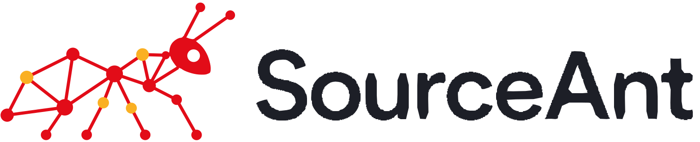

<p align="center">
  <picture>
    <source media="(prefers-color-scheme: dark)" srcset="docs/assets/sourceant-logo-dark.svg">
    
  </picture>
</p>

<p align="center"><strong>Software intelligence for you and your coding agents.</strong></p>

AI is writing code faster than you and your team can understand it. SourceAnt helps you stay ahead. It shows you what is being built, checks changes against your decisions and requirements, and keeps your system architecture visible as the code moves.

You can let agents move quickly without giving up control of where your software is going.

It runs on a laptop with nothing configured and no account.

## How it works

SourceAnt tracks four connected views of your software:

1. **Code graph:** A map of your files, symbols and the relationships between them.
2. **Knowledge graph:** What you know, or should know, about the code. This includes decisions, rules, constraints and conventions.
3. **Requirements graph:** A specialized part of the knowledge graph that records what the software is supposed to do and links it to the code and tests that carry it.
4. **System graph:** Living architecture documentation that shows how services, components, repositories and datastores connect.

SourceAnt uses this information to review code with your intent in view. It also gives you and your agents the architecture and context needed to understand how the system fits together.

This helps you answer two questions:

1. Do I understand what is being built and where it is taking the system?
2. Are my agents still respecting the decisions and requirements that matter?

## Use SourceAnt locally

Install SourceAnt to get:

- One local code index for all your repositories.
- Local knowledge and requirements that persist between sessions.
- Local code reviews before a change reaches your colleagues.
- Context over MCP for the coding tools you already use.

Catch context-blind changes early. Keep the useful knowledge they uncover. Stay in control of what ships.

## Start here

```bash
git clone https://github.com/sourceant/sourceant.git
cd sourceant
pip install -r requirements.txt

./sourceant db upgrade head          # keeps its data in your user directory
./sourceant repo add ~/code/your-project
./sourceant index ~/code/your-project
```

That parses every file the repository does not ignore. Index a second repository and it goes into the same store, under its own scope, rather than leaving an artifact in the folder.

Running it again reparses only what changed:

```bash
./sourceant index ~/code/your-project --update
```

Point an MCP client at the server and it reads your code, knowledge, requirements and system context:

```bash
python -m src.mcp_server
```

See [Local index](docs/local-index.md) for the whole command set, and [Knowledge and context](docs/context.md) for what the server exposes.

## How the graphs behave

### Code graph

Files, symbols, imports and definitions. Built by `sourceant index`, or loaded from a SCIP index another tool produced. A local index describes the working tree. Code used in a review is pinned to the reviewed commit, so it cannot cite uncommitted work.

### Knowledge graph

What the team decided and why. Every item has a kind: decision, rule, constraint, convention. A **requirement** is a kind within this graph, so what the software is meant to do sits beside the reasoning behind it and answers the same searches.

Requirements form a specialized subgraph with their own links and coverage queries.

Knowledge is filed against the repository, not a commit. A decision recorded once keeps applying to every later change.

Items link to each other, and to the files they govern. That link is what lets a review of one file find the decision that constrains it.

In a local installation, this knowledge is used only by reviews run on that same local instance.

### System graph

Living documentation of how your software fits together and how that architecture changes. It shows you where code is pushing the system, so you can decide whether to allow that direction. It gives your agents the connections between services, components, repositories and datastores before they change code.

The graph is independent of repository layout, so one system can span several repositories and one repository can hold several systems.

Two more stores answer the same interfaces but keep nothing in the core: **contracts**, the API surfaces and what changed between versions, and **review findings**, what a review raised and what became of it. A plugin makes either durable.

### Separate lifecycles, shared context

A scope is an open map of key-value pairs you choose. A personal project can use `{"project": "shop"}`. An integration can use `{"organization": "acme", "repository": "acme/billing"}`. Nothing in the core needs to know which keys you picked.

Scope lets an application join related records without pretending they age together. Local code follows the working tree, review code follows a revision, knowledge belongs to a repository, and system records describe architecture across repository boundaries. A query names one scope, so asking across two repository scopes at once is not something the core does yet.

## Over MCP

| Tool | Purpose |
|---|---|
| `search_code` | Find files and symbols by label and property |
| `trace_code` | Walk the neighbourhood around a symbol |
| `put_knowledge` | Record a decision, rule, constraint, or convention |
| `put_knowledge_relationship` | Connect knowledge with `depends_on`, `supports`, `contradicts` |
| `search_knowledge` | Find knowledge by scope, identity, type, or property |
| `put_topology_entity` | Record a part of the system |
| `put_topology_relationship` | Record how two parts relate |
| `traverse_topology` | Walk the system graph from a set of seeds |
| `put_requirement` | Record what the software is meant to do |
| `link_requirement` | Point a requirement at the code or test that carries it |
| `search_requirements` | Find requirements by identity, kind, status, or origin |
| `get_requirement_coverage` | What has code, what has tests, what a change touches |
| `get_context` | Combine any of the above into one bounded pack |

To an MCP-enabled agent this is ordinary instruction:

```text
Remember that project shop uses signed webhook requests. Store it as an approved decision.

Connect the signed webhook decision to the rule that rejects unsigned requests.

Get the approved knowledge related to the signed webhook decision before changing its handler.
```

Storage is replaceable. Inject another `KnowledgeRepository`, `TopologyRepository`, or `CodeIndexRepository` and the same tools keep working against it.

## Applications

- **[Code review](docs/reviews.md)** reads the graph for structure around a change before it comments.
- **[Issue triage](docs/triage.md)** finds duplicates and labels what comes in.
- **[Repo management](docs/repo-management.md)** automates the housekeeping around both.

These need model access and, for GitHub, an app.

## Documentation

| | |
|---|---|
| [Quick start](docs/quick-start.md) | Get something running |
| [Local index](docs/local-index.md) | Index repositories on your own machine |
| [Knowledge and context](docs/context.md) | The knowledge server and context packs |
| [Requirements](docs/requirements.md) | What the software is meant to do |
| [Systems](docs/systems.md) | Software topology |
| [Configuration](docs/configuration.md) | Every environment variable |
| [GitHub App setup](docs/github-app.md) | Self-hosted GitHub integration |
| [API](docs/api.md) | HTTP endpoints |
| [Deployment](docs/deployment.md) | Images, compose, and running it as a service |

Models come through [LiteLLM](https://docs.litellm.ai/docs/providers), so Gemini, Anthropic, OpenAI, DeepSeek, Mistral, and 100+ other providers work by setting two variables.

## SourceAnt Cloud

The core is MIT licensed and self-hostable in full. [SourceAnt Cloud](https://app.sourceant.ai) runs the same engine with a managed layer on top: memory your team curates, contract analysis, continuous indexing at scale, the explorable graph, workspaces and roles, and analytics.

## Contributing

1. Fork the repository.
2. Create a branch: `git checkout -b feature/your-feature`.
3. Commit your changes.
4. Push and open a pull request.

Tests and formatting are what CI checks:

```bash
docker compose exec app pytest src/tests/ -v
docker compose exec app sourceant code lint
```

## License

MIT. See [LICENSE](LICENSE.md).

## Contact

- **Email**: hello@sourceant.ai
- **Issues**: [Open an issue](https://github.com/sourceant/sourceant/issues)

<a href="https://github.com/sourceant/sourceant/graphs/contributors">
  
</a>

Maintained by [WhileSmart](https://whilesmart.com).
